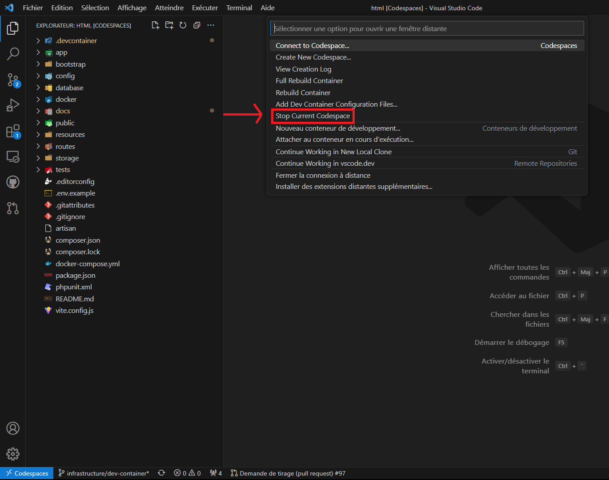
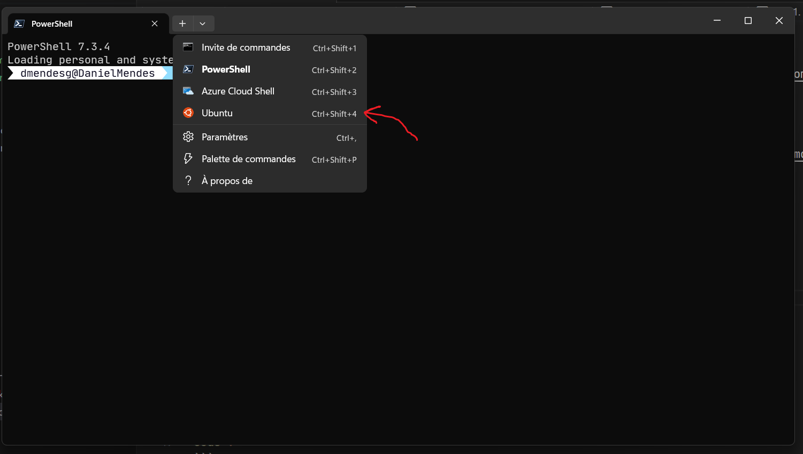
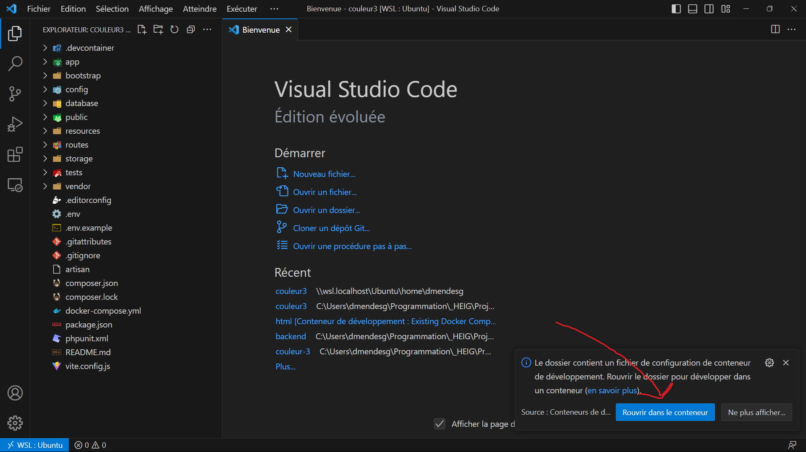

# Environnement de développement

```mermaid
flowchart TB
    subgraph Ordinateur local
        subgraph vscode[VS Code]
            extension[Extension]
        end

        sourceCode[Code source]

        subgraph devContainer[Conteneur Docker]
            mysql[(MySQL)]
            redis[(Redis)]
            minio[(Minio)]
            soketi[Soketi]
            phpmyadmin[phpMyAdmin]
            mailpit[Mailpit]

            remoteSourceCode[Code source]
        end

        vscode -->|"localhost:80 (Application)
            localhost:8025 (Mailpit)
            localhost:8080 (phpMyAdmin)"| devContainer
        sourceCode -.->|synchronisé| remoteSourceCode
    end
```

> Nous utilisons Docker pour créer un environnement de développement isolé. Cela permet de ne pas avoir à installer les dépendances sur votre ordinateur et de pouvoir partager le même environnement de développement entre tous les développeurs. Cela permet aussi de ne pas avoir à installer PHP, MySQL, Redis, etc. sur votre ordinateur.

## Utiliser GitHub Codespaces (recommandé)

### 1. Créer un codespace

-   Ouvrir le projet dans GitHub
-   Cliquer sur le bouton `Code` et sélectionner l'onglet `Codespaces`
-   Cliquer sur le bouton `Create codespace on main`


### 2. Ouvrir le codespace dans VS Code ou PhpStorm

-   Faire suivant suivant, ouvrir ouvrir, oui oui, installer installer, etc.

Après quelques minutes, vous devriez voir une fenêtre de sélection de l'environnement de développement s'ouvrir.

### 3. Ouvrir l'application dans le navigateur

Quand le conteneur est prêt, vous devriez voir un icône (une petite antenne) dans la barre d'outils de VS Code.

Cette vue liste tous les points d'entrée disponible.


Vous pouvez maintenant ouvrir l'application dans votre navigateur à l'adresse [http://localhost:80](http://localhost:80).


Voilàà ! Vous pouvez maintenant commencer à développer.

### 4. (Attention) Avant de fermer VS Code

Avant de fermer VS Code, il faut arrêter le conteneur.

-   En bas à gauche, cliquer sur l'icône `>< Codespaces` pour ouvrir le menu des codespaces
-   Cliquer sur l'option `Stop Current Codespace`, sinon le conteneur va continuer de tourner et le temps sera décompté de votre forfait (60 heures gratuit par mois).



## Configuration sur Windows

## Prérequis

-   [Docker](https://www.docker.com/)
-   [WSL2](https://learn.microsoft.com/en-us/windows/wsl/about)
-   [VS Code](https://code.visualstudio.com/)
-   [VS Code - Remote Development (Extension)](https://marketplace.visualstudio.com/items?itemName=ms-vscode-remote.vscode-remote-extensionpack)

### 1. Cloner le projet

Ouvrir l'application _Terminal_ et sélectionner le sous-système Ubuntu.



```bash
git clone https://github.com/C-Super/couleur3.git
```

### 2. Ouvrir le projet dans VS Code

Ouvrir le dossier du projet dans VS Code en utilisant le terminal Ubuntu.

```bash
cd couleur3 && code .
```

### 3. Ouvrir le projet dans un conteneur

Si ce n'est pas déjà fait, installer l'extension [Remote Development](https://marketplace.visualstudio.com/items?itemName=ms-vscode-remote.vscode-remote-extensionpack) dans VS Code.

Et n'oubliez pas de lancer l'application Docker Desktop, avant !

Vous devriez voir une fenêtre de sélection de l'environnement de développement s'ouvrir.



Si vous ne voyer pas la fenêtre de sélection de l'environnement de développement.

-   Ouvrir la palette de commande (Ctrl + Shift + P)
-   Rechercher et sélectionner `Remote-Containers: Open Folder in Container...`
-   Sélectionner le dossier du projet

Cela peut prendre quelques minutes la première fois que vous ouvrez le projet dans un conteneur.

### 4. Ouvrir l'application dans le navigateur

Quand le conteneur est prêt, vous devriez voir un icône (une petite antenne) dans la barre d'outils de VS Code.


Vous pouvez maintenant ouvrir l'application dans votre navigateur à l'adresse [http://localhost:8080](http://localhost:80).


Voilàà ! Vous pouvez maintenant commencer à développer.

### 5. Installer les extensions VS Code recommandées

### 6. Conclusion

Quand vous ouvrirez VS Code, les prochaines fois, vous pourrez ouvrir le projet dans un conteneur en cliquant sur l'icône de l'antenne dans la barre d'outils.

## Configuration sur Mac
